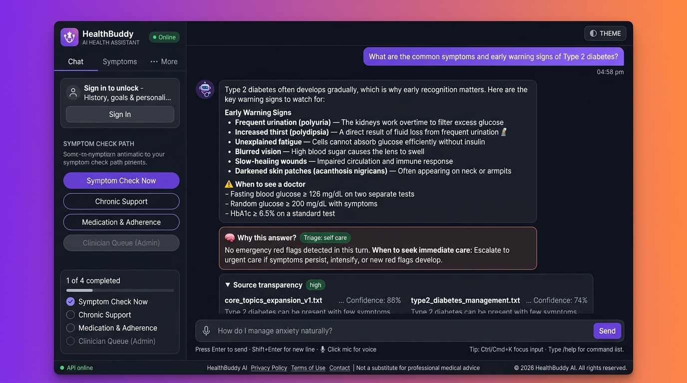
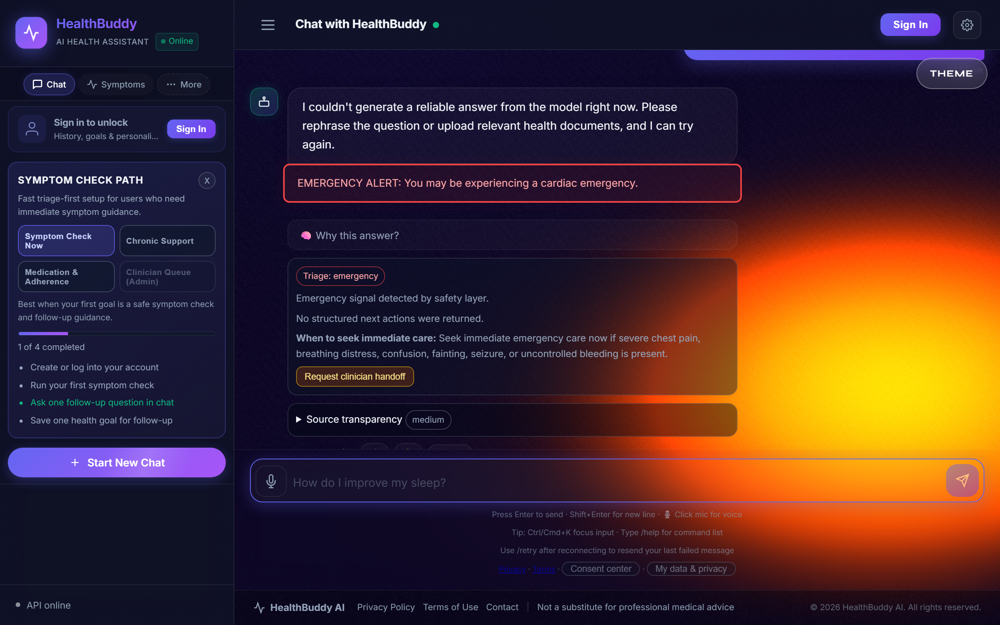
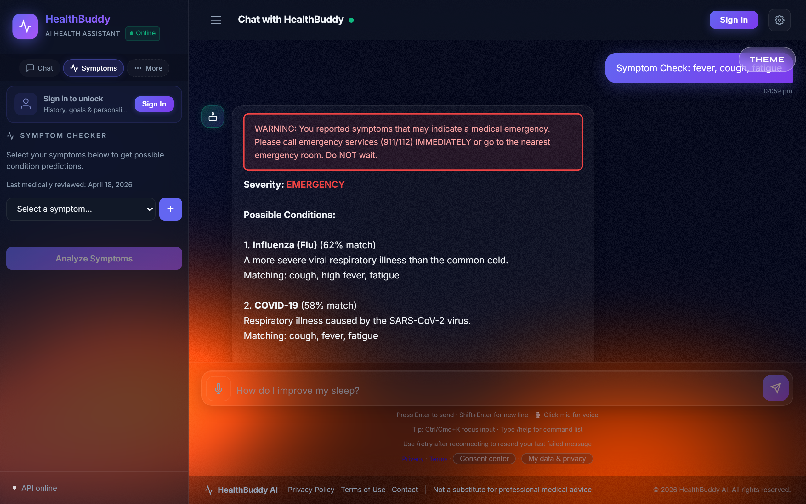
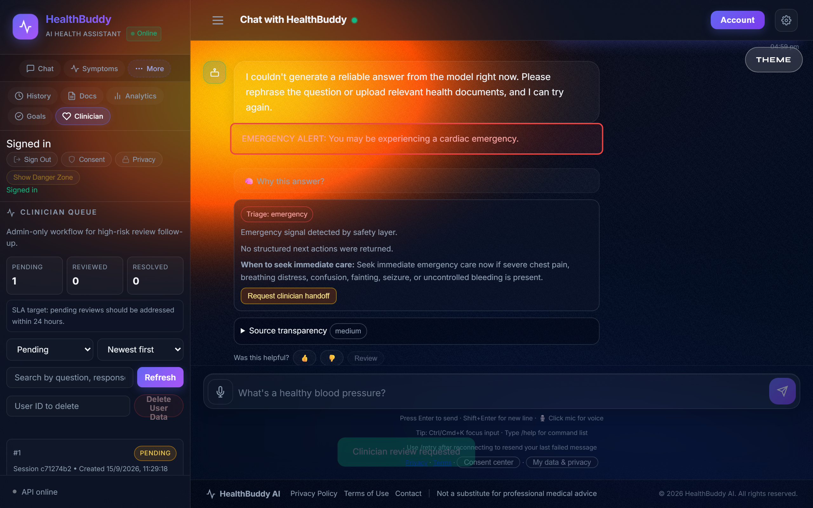
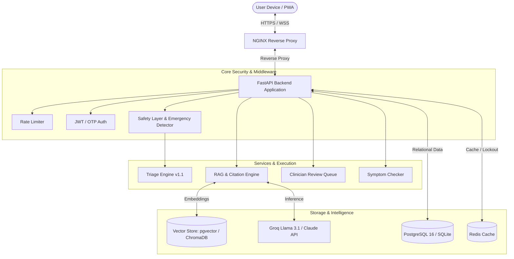

<p align="center">
  
</p>

<h1 align="center">HealthBuddy AI Assistant</h1>

<p align="center">
  <strong>AI Health Assistant with Clinical Safety Guardrails, RAG, pgvector &amp; Multilingual Support</strong>
</p>

<p align="center">
  <a href="https://github.com/DevPranavJad700/healthbuddy-ai-assistant/actions"></a>
  
  
  
  
  
  
  
  <a href="LICENSE"></a>
</p>

---

## 📑 Table of Contents
- [Screenshots / Demo](#-screenshots--demo)
- [Overview](#-overview)
- [Key Features](#-key-features)
- [System Architecture](#-system-architecture)
- [Modular Frontend Structure](#-modular-frontend-structure)
- [Clinical Knowledge Base & RAG](#-clinical-knowledge-base--rag)
- [Medical Safety & Triage Engine](#-medical-safety--triage-engine)
- [Quick Start (Local Development)](#-quick-start-local-development)
- [Production Deployment (Docker + pgvector)](#-production-deployment-docker--pgvector)
- [API Reference](#-api-reference)
- [Automated Testing Suite](#-automated-testing-suite)
- [Security & Privacy](#-security--privacy)
- [Observability & Monitoring](#-observability--monitoring)
- [Design Decisions](#-design-decisions)
- [License](#-license)

---

## 📸 Screenshots / Demo

| **Conversational RAG & Source Citations** | **Emergency Safety Triage Overlay** |
|:---:|:---:|
|  |  |
| *Real-time SSE streaming with verified clinical citations & confidence scoring* | *Deterministic emergency intercept before any LLM inference occurs* |

| **Symptom Checker & Urgency Assessment** | **Clinician Review Queue (Admin)** |
|:---:|:---:|
|  |  |
| *Multi-symptom condition matching with severity tiering & recommendations* | *Audit-tracked review queue for clinical safety escalation* |

> Automated high-resolution captures generated via Playwright (`python scripts/capture_screenshots.py`). See [`docs/screenshots/README.md`](docs/screenshots/README.md) for details.

---

## 🩺 Overview

**HealthBuddy AI Assistant** is a clinically-aware digital healthcare companion structured for
deployment with Docker, PostgreSQL, Redis, and NGINX. It combines Retrieval-Augmented Generation
(RAG) with a deterministic clinical triage engine, multi-layer safety moderation, and
GDPR-oriented data controls.

> ⚠️ **Clinical Disclaimer**: HealthBuddy AI is intended strictly for educational guidance and informational triage. It does not replace licensed medical diagnosis, physical examinations, or emergency medical interventions. In life-threatening emergencies, seek care immediately via your regional emergency number (e.g., 911, 112, 999).

---

## ✨ Key Features

### 🧠 RAG & Dual Vector Storage
- **Dual Vector Storage**: Supports **PostgreSQL 16 + pgvector** for PostgreSQL deployments alongside **ChromaDB** for local development. The store type is selected at startup based on `VECTOR_STORE_TYPE` and `DATABASE_URL`.
- **SSE Streaming Responses**: Real-time Server-Sent Events stream tokens with Markdown rendering and source citation cards.
- **Multilingual Knowledge Grounding**: 32 curated clinical guide files spanning English, Hindi, and Spanish with language-priority chunk retrieval.
- **Source Traceability**: Generated answers include retrieved document metadata (source, relevance score, excerpt) returned alongside the response.

### 🛡️ Multi-Layer Medical Safety
- **Emergency Detection**: Scans for 6 life-threatening emergency archetypes (cardiac arrest, stroke, respiratory failure, mental health/suicide crisis, acute poisoning, severe bleeding) and returns an immediate emergency message before any LLM call is made.
- **Deterministic Triage Ruleset (`v1.1`)**: Assigns urgency levels (`emergency`, `urgent`, `self_care`) with actionable next steps. Rules are versioned, readable, and auditable without ML tooling.
- **Bidirectional Moderation**: `check_user_input()` scans user queries for emergency patterns; `check_model_output()` scans LLM responses for harmful dosage advice, unauthorized prescribing, or diagnostic overreach, and replaces flagged responses with a safe refusal.
- **Clinician Oversight Queue**: Escalated cases are stored in a `clinician_reviews` table with status tracking (`pending`, `reviewed`, `resolved`), accessible via the admin dashboard and API.

### 📱 Modular Frontend
- **Zero Build Complexity**: Pure modern ES Modules — no Webpack, Vite, or bundler required.
- **WebGL Background**: Three.js liquid shader background, dark glassmorphism UI, responsive down to 320px.
- **PWA & Offline Capability**: Service Worker caching allows offline load with connectivity banner and auto-retry.
- **Accessibility (WCAG-targeted)**: Keyboard tab trapping, screen reader announcements (`aria-live`), high-contrast mode, reduced motion, and large text options.
- **Voice & Document Input**: Web Speech API for voice dictation and drag-and-drop document uploads (PDF, TXT, MD) for per-user RAG indexing.

### 🔒 Security & Privacy
- **JWT + Refresh Token Rotation**: Access tokens and refresh tokens use distinct `typ` claims and unique `jti` IDs. On `/refresh`, the incoming refresh token's JTI is revoked in the `RevokedToken` table before a new token pair is issued.
- **Email OTP Verification**: 6-digit OTP, 15-minute expiry, 5-attempt brute-force lockout; stored in Redis with an in-memory fallback for environments without Redis.
- **GDPR-Oriented Features**: Single-click user data export (right to portability, Art. 20) and permanent account deletion cascade across all user-associated tables (right to erasure, Art. 17). Both endpoints are authenticated and audit-logged.
- **Privacy Consent Acknowledgment**: Consent timestamp is recorded on registration.

---

## 🏗️ System Architecture



---

## 📂 Modular Frontend Structure

```
frontend/
├── index.html                  # Main SPA container (<script type="module" src="/static/app.js">)
├── app.js                      # Primary orchestrator & global DOM event bindings
├── styles.css                  # Unified design system and responsive dark mode CSS
├── liquid-theme.js             # Three.js WebGL shader background
├── manifest.json               # Progressive Web App manifest
├── sw.js                       # Service Worker for offline asset caching
├── icons/                      # PWA icons (192x192, 512x512)
└── modules/
    ├── config.js               # API endpoints, SVG icons, emergency numbers, I18N
    ├── state.js                # Reactive client state and auth token accessors
    ├── utils.js                # HTML escaping, toast popups, a11y focus manager
    ├── auth.js                 # Authentication, profile onboarding, GDPR export/delete
    ├── chat.js                 # SSE streaming reader, bubble renderer, session history
    ├── symptoms.js             # Interactive symptom tag selector & triage cards
    ├── analytics.js            # Chart.js operational dashboard & clinician review queue
    ├── documents.js            # Drag-and-drop document uploader & chunk management
    ├── goals.js                # Health goals CRUD & preset priority chips
    ├── voice.js                # Web Speech API speech-to-text integration
    └── onboarding.js           # Multi-step health profile wizard & a11y settings
```

---

## 📚 Clinical Knowledge Base & RAG

The repository includes **32 clinical guide files** located in `data/knowledge_base/`:
- **Cardiovascular Health**: Acute coronary syndromes, hypertension protocols, heart failure management.
- **Endocrine & Metabolic**: Type-2 diabetes regimens, glycemic monitoring, lifestyle intervention.
- **Respiratory Medicine**: Asthma triggers, COPD action plans, acute bronchitis protocols.
- **Mental Health**: Crisis intervention protocols, anxiety & depression triage, stress reduction.
- **Specialized Fields**: Pediatrics, Women's Health, Dermatology, Gastroenterology, Sleep Medicine, Sports Medicine, Pharmacology, Nutrition.
- **Multilingual Support**: Hindi (`naidanik_margdarshika_hindi.txt`) and Spanish (`guia_clinica_espanol.txt`) guidelines.

---

## 🚀 Quick Start (Local Development)

**Prerequisites:** Python 3.11+, a [Groq API key](https://console.groq.com) (free tier works).  
**Expected time:** ~5 minutes (plus ~2 minutes on first run for the embedding model to download).

### 1. Clone the Repository
```bash
git clone https://github.com/DevPranavJad700/healthbuddy-ai-assistant.git
cd healthbuddy-ai-assistant
```

### 2. Set Up Virtual Environment
```bash
# Windows
python -m venv .venv
.venv\Scripts\activate

# Linux / macOS
python3 -m venv .venv
source .venv/bin/activate
```

### 3. Install Dependencies
```bash
pip install -r requirements.txt
```

### 4. Configure Environment Variables
```bash
cp .env.development.example .env
```

Open `.env` and set **at minimum**:
```env
GROQ_API_KEY=your_groq_key_here
SECRET_KEY=any_random_string_at_least_32_characters_long
```

Everything else in `.env.development.example` works as-is for local development (SQLite database, ChromaDB vector store, no Redis required).

### 5. (First run only) Index the Knowledge Base
```bash
python scripts/reindex_knowledge_base.py
```

> **Note:** On first run this downloads the embedding model (`all-MiniLM-L6-v2`, ~90 MB) and indexes the 32 knowledge files into ChromaDB. Subsequent starts skip this step because the vectors are persisted in `data/chroma_db/`. If you add new knowledge files later, re-run this script to update the index.


### 6. Start Development Server
```bash
uvicorn app.main:app --host 127.0.0.1 --port 8000 --reload
```

Open **http://127.0.0.1:8000** in your browser.  
Swagger/OpenAPI docs: **http://127.0.0.1:8000/api/docs**

---

## 🐳 Production Deployment (Docker + pgvector)

The production configuration runs the application, PostgreSQL 16 with `pgvector`, Redis, and NGINX in Docker Compose:

```bash
# 1. Copy production template and fill in secrets
cp .env.production.example .env

# 2. Launch containerised stack
docker compose -f docker-compose.production.yml up -d --build

# 3. Check health
docker compose -f docker-compose.production.yml ps
curl http://localhost/api/health
```

See `docs/OPERATOR_RUNBOOK.md` for configuration details, backup/restore, and upgrade procedures.

---

## 🔌 API Reference

| Method | Endpoint | Description | Auth Required |
| :--- | :--- | :--- | :---: |
| `GET` | `/api/health` | Service health status & vector store ready state | No |
| `GET` | `/api/live` | Docker/Kubernetes liveness probe | No |
| `GET` | `/api/ready` | Docker/Kubernetes readiness check | No |
| `POST` | `/api/v1/auth/register` | User account registration | No |
| `POST` | `/api/v1/auth/login` | Login — returns access & refresh tokens | No |
| `POST` | `/api/v1/auth/refresh` | Exchange refresh token for rotated token pair | Refresh Token |
| `POST` | `/api/v1/auth/verify-email` | Verify email with 6-digit OTP | No |
| `POST` | `/api/v1/auth/forgot-password` | Send password reset OTP | No |
| `POST` | `/api/v1/auth/export-my-data` | GDPR data export (Art. 20) | Bearer Token |
| `POST` | `/api/v1/auth/delete-my-data` | GDPR permanent account deletion (Art. 17) | Bearer Token |
| `POST` | `/api/v1/chat` | Non-streaming conversational RAG endpoint | Optional |
| `POST` | `/api/v1/chat/stream` | Real-time SSE streaming RAG response | Optional |
| `POST` | `/api/v1/chat/feedback` | Submit feedback rating on a response | Optional |
| `POST` | `/api/v1/chat/clinician-review` | Escalate case to clinician queue | Bearer Token |
| `POST` | `/api/v1/symptoms/check` | Triage classification and condition matching | No |
| `GET` | `/api/v1/symptoms/list` | List of supported symptom keywords | No |
| `GET` | `/api/v1/documents` | List uploaded user documents | Bearer Token |
| `POST` | `/api/v1/documents/upload` | Upload PDF/TXT/MD document for RAG indexing | Bearer Token |
| `GET` | `/api/v1/personalization/goals` | List personal health goals | Bearer Token |
| `POST` | `/api/v1/personalization/goals` | Create a new health goal | Bearer Token |
| `GET` | `/api/v1/analytics/dashboard` | Usage metrics dashboard | Admin |
| `GET` | `/api/v1/analytics/clinician-reviews` | Clinician triage review queue | Admin |

---

## 🧪 Automated Testing Suite

```bash
# Unit tests — safety, triage, symptom checker, email OTP
pytest tests/test_safety_layer.py tests/test_triage_rules.py tests/test_symptom_checker.py tests/test_email_verification.py -v

# API integration tests
pytest tests/test_api.py -v

# Browser end-to-end tests (requires Playwright)
pytest tests/test_e2e_browser.py -v
```

### Verified Test Matrix (122/122 Passed)

| File | Count | Status | Covers |
|---|---|---|---|
| `test_safety_layer.py` | 23 | Passed | Cardiac, stroke, respiratory, poisoning, bleeding, mental health crisis detection; bidirectional output moderation |
| `test_triage_rules.py` | 13 | Passed | Deterministic ruleset validation across rule IDs, urgency tiers (`emergency`, `urgent`, `self_care`), versioning |
| `test_symptom_checker.py` | 16 | Passed | Severity ranking, condition match percentages, emergency detection in symptom descriptions |
| `test_email_verification.py` | 17 | Passed | 6-digit OTP generation, expiry, brute-force lockout, password reset flows |
| `test_api.py` | 44 | Passed | HTTP routing, CSRF protection, sliding-window rate-limiting, GDPR export/deletion, session isolation, auth lockout |
| `test_fhir_service.py` | 2 | Passed | FHIR R4 bundle structure and patient resource generation |
| `test_redis_client.py` | 2 | Passed | Redis connection pool and graceful in-memory fallback |
| `test_vision_service.py` | 4 | Passed | Medical image analysis and heuristic fallback |
| `test_e2e_browser.py` | 5 | Passed | Full browser flows: auth & health goals, chat & feedback, SSE streaming completion, clinician triage queue, GDPR account deletion |

> All 117 unit/integration tests verified passing via `pytest`. E2E Playwright tests (`test_e2e_browser.py`) run against a live local server (`RUN_E2E=1`).

---

## 📊 Observability & Monitoring

- **Prometheus Metrics Endpoint**: `/api/metrics` — tracks request counts, latency histograms, LLM provider failures, fallback responses, and token refresh outcomes.
- **Grafana Dashboard**: Pre-configured dashboard at `deploy/grafana-dashboard.json`.
- **Prometheus Alert Rules**: Template at `deploy/prometheus-alert-rules.yml`.
- **Structured JSON Logging**: Every request logged with a unique `X-Request-ID` correlation header, subject identifier, session ID, method, path, status, and latency.

---

## 🔐 Security & Privacy

- **Rate Limiting**: Sliding-window rate limiter with Redis backend (in-memory fallback). Per-route overrides — auth endpoints have tighter limits than chat endpoints.
- **Brute-Force Lockout**: Per-username and per-IP failed login tracking with configurable lockout duration.
- **CSRF Protection**: Origin/Referer validation for browser-initiated state-mutating requests; Bearer-token API clients are exempt.
- **Security Headers**: CSP, X-Frame-Options, X-Content-Type-Options, HSTS injected on every response.
- **Password Policy**: Minimum length, uppercase, lowercase, and digit requirements enforced at registration.
- **Audit Log**: Key auth and data-access actions are written to an `audit_log` table.

---

## 📐 Design Decisions

See [`DESIGN_DECISIONS.md`](DESIGN_DECISIONS.md) for first-person reasoning on:

- Why a deterministic triage ruleset instead of an ML classifier
- How the 6 emergency archetypes were selected (WHO/NIH preventable-death categories)
- Why pgvector vs ChromaDB and when each is used
- What the moderation layer checks on input vs output, and what it does not cover

---

## 📄 License

This project is licensed under the MIT License — see the [LICENSE](LICENSE) file for details.
