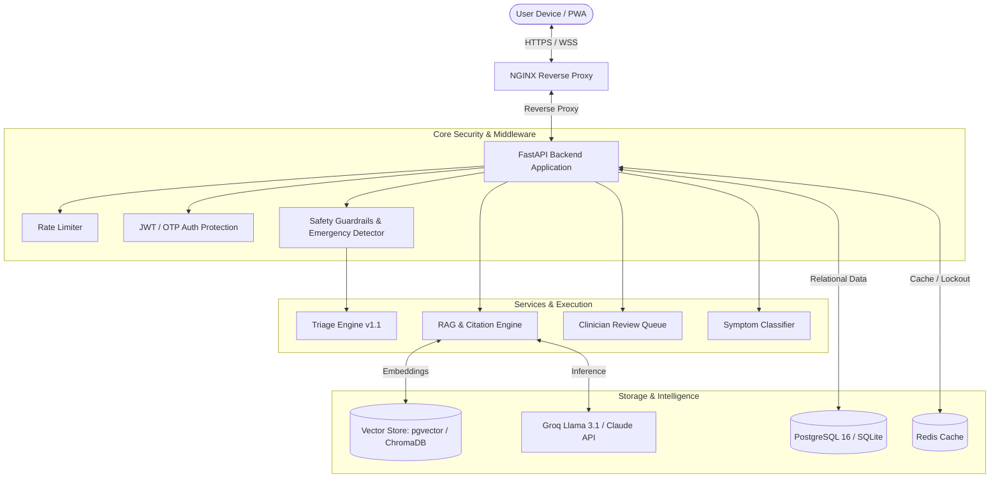

<p align="center">
  
</p>

<h1 align="center">HealthBuddy AI Assistant</h1>

<p align="center">
  <strong>Production-Grade AI Health Assistant with Clinical Safety Guardrails, Multimodal RAG, pgvector & Multilingual Support</strong>
</p>

<p align="center">
  <a href="https://github.com/DevPranavJad700/healthbuddy-ai-assistant/actions"></a>
  
  
  
  
  
  
  
  <a href="LICENSE"></a>
</p>

---

## 📑 Table of Contents
- [Overview](#-overview)
- [Key Features](#-key-features)
- [System Architecture](#-system-architecture)
- [Modular Frontend Structure](#-modular-frontend-structure)
- [Clinical Knowledge Base & RAG](#-clinical-knowledge-base--rag)
- [Medical Safety & Triage Engine](#-medical-safety--triage-engine)
- [Quick Start (Local Development)](#-quick-start-local-development)
- [Production Deployment (Docker + pgvector)](#-production-deployment-docker--pgvector)
- [API Reference](#-api-reference)
- [Automated Testing Suite](#-automated-testing-suite)
- [Security & Compliance (GDPR)](#-security--compliance-gdpr)
- [Observability & Monitoring](#-observability--monitoring)
- [License](#-license)

---

## 🩺 Overview

**HealthBuddy AI Assistant** is a real-world, clinically-aware digital healthcare companion built to enterprise standards. Combining high-throughput Retrieval-Augmented Generation (RAG) with a deterministic clinical triage system, multi-tier safety moderation, and GDPR compliance, HealthBuddy assists users with symptom guidance, condition education, and care-seeking navigation.

> ⚠️ **Clinical Disclaimer**: HealthBuddy AI is engineered strictly for educational guidance and informational triage. It does not replace licensed medical diagnosis, physical examinations, or emergency medical interventions. In life-threatening emergencies, immediate care must be sought via regional emergency numbers (e.g., 911, 112, 999).

---

## ✨ Key Features

### 🧠 Advanced RAG & Dual Vector Storage
- **Unified Vector Storage**: Supports **PostgreSQL 16 + pgvector** for enterprise deployments alongside **ChromaDB** for local development.
- **SSE Streaming Responses**: Real-time Server-Sent Events stream tokens smoothly with Markdown rendering and explainability cards.
- **Multilingual Knowledge Grounding**: 22 curated clinical guideline files spanning English, Hindi, and Spanish with language-priority chunk retrieval.
- **Source Traceability**: Every generated answer cites relevant clinical protocols, confidence scores, and excerpt snippets.

### 🛡️ Multi-Layer Medical Safety
- **Emergency Detection**: Scans for 6 life-threatening emergency archetypes (cardiac arrest, stroke, respiratory failure, mental health/suicide crisis, acute poisoning, severe bleeding) and triggers immediate emergency overlays.
- **Deterministic Triage Ruleset (`v1.1`)**: Assigns urgency levels (`emergency`, `urgent`, `self_care`) with actionable next steps and SLA thresholds.
- **Bidirectional Moderation**: Analyzes user input queries and filters model output for harmful dosage advice, unauthorized prescribing, or diagnostic overreach.
- **Clinician Oversight Queue**: Flags borderline and escalated cases for licensed clinical review with note attachments and status tracking (`pending`, `reviewed`, `resolved`).

### 📱 Premium Native Modular Frontend
- **Zero Build Complexity**: Built using pure modern ES Modules without requiring Webpack, Vite, or external bundlers.
- **Fluid WebGL Aesthetics**: Three.js liquid background theme, sleek dark glassmorphism, responsive down to 320px screens.
- **PWA & Offline Capability**: Service Worker caching allows offline load with connectivity banner and auto-retry.
- **Accessibility First (WCAG Compliant)**: Full keyboard tab trapping, screen reader announcements (`aria-live`), high-contrast mode, reduced motion, and large text options.
- **Multi-Modal Input**: Integrated Web Speech API for voice-driven query dictation and drag-and-drop clinical document uploads (PDF, TXT, MD).

### 🔒 Enterprise Security & Privacy
- **JWT + Refresh Token Rotation**: Secure session lifecycle with brute-force lockout protections and in-memory/Redis tracking.
- **Email OTP Verification**: Registration email verification and password reset flows with configurable SMTP or dev-log delivery.
- **GDPR & HIPAA Readiness**: Single-click encrypted user data export and permanent account deletion cascades with auditable logs.
- **Granular Consent Center**: Explicit policy tracking for AI Guidance, Terms of Use, and Personalization.

---

## 🏗️ System Architecture



---

## 📂 Modular Frontend Structure

The user interface is completely organized into native ES modules served directly by FastAPI under `/static`:

```
frontend/
├── index.html                  # Main SPA container (<script type="module" src="/static/app.js?v=45">)
├── app.js                      # Primary orchestrator & global DOM event bindings
├── ARCHITECTURE.js             # Architecture and module loading reference
├── styles.css                  # Unified design system and responsive dark mode CSS
├── liquid-theme.js             # Three.js WebGL shader background
├── manifest.json               # Progressive Web App manifest
├── sw.js                       # Service Worker for offline asset caching
├── icons/                      # PWA icons (192x192, 512x512)
└── modules/
    ├── config.js               # API endpoints, SVG icons, emergency numbers, I18N
    ├── state.js                # Reactive client state and auth token accessors
    ├── utils.js                # HTML escaping, toast popups, a11y focus manager
    ├── auth.js                 # Authentication, OAuth, profile onboarding, GDPR export/delete
    ├── chat.js                 # SSE streaming reader, bubble renderer, session history
    ├── symptoms.js             # Interactive symptom tag selector & triage cards
    ├── analytics.js            # Chart.js operational dashboard & clinician review queue
    ├── documents.js            # Drag-and-drop document uploader & chunk management
    ├── goals.js                # Health goals CRUD & preset priority chips
    ├── voice.js                # Web Speech API speech-to-text integration
    └── onboarding.js           # Multi-step health profile wizard & a11y settings
```

---

## 📚 Clinical Knowledge Base & RAG

The repository includes **22 evidence-based clinical guide files** located in `data/knowledge_base/`:
- **Cardiovascular Health**: Acute coronary syndromes, hypertension protocols, heart failure management.
- **Endocrine & Metabolic**: Type-2 diabetes regimens, glycemic monitoring, lifestyle intervention.
- **Respiratory Medicine**: Asthma triggers, COPD action plans, acute bronchitis protocols.
- **Mental Health**: Crisis intervention protocols, anxiety & depression triage, stress reduction.
- **Specialized Fields**: Pediatrics, Women's Health, Dermatology, Gastroenterology, Sleep Medicine, Sports Medicine, Pharmacology.
- **Multilingual Support**: Hindi (`naidanik_margdarshika_hindi.txt`) and Spanish (`guia_clinica_espanol.txt`) specialized guidelines.

---

## 🚀 Quick Start (Local Development)

### 1. Clone the Repository
```bash
git clone https://github.com/DevPranavJad700/healthbuddy-ai-assistant.git
cd healthbuddy-ai-assistant
```

### 2. Set Up Virtual Environment
```bash
# Windows
python -m venv .venv
.venv\Scripts\activate

# Linux / macOS
python3 -m venv .venv
source .venv/bin/activate
```

### 3. Install Dependencies
```bash
pip install -r requirements.txt
```

### 4. Configure Environment Variables
```bash
cp .env.development.example .env
# Edit .env and configure at least your GROQ_API_KEY (obtainable at console.groq.com)
```

### 5. Start Development Server
```bash
uvicorn app.main:app --host 127.0.0.1 --port 8000 --reload
```
Open **http://127.0.0.1:8000** in your browser. Interactive Swagger docs are available at **http://127.0.0.1:8000/api/docs**.

---

## 🐳 Production Deployment (Docker + pgvector)

The production configuration unifies application services, PostgreSQL 16 with the `pgvector` extension, Redis caching, NGINX reverse proxy, and Let's Encrypt SSL:

```bash
# 1. Copy production template
cp .env.production.example .env

# 2. Launch containerized stack
docker compose -f docker-compose.production.yml up -d --build

# 3. Check health and running status
docker compose -f docker-compose.production.yml ps
```

---

## 🔌 API Reference

| Method | Endpoint | Description | Auth Required |
| :--- | :--- | :--- | :---: |
| `GET` | `/api/health` | Service health status & vector store ready state | No |
| `GET` | `/api/live` | Kubernetes / Docker liveness probe | No |
| `GET` | `/api/ready` | Kubernetes / Docker readiness check | No |
| `POST` | `/api/v1/auth/register` | User account registration | No |
| `POST` | `/api/v1/auth/login` | User login (returns access & refresh tokens) | No |
| `POST` | `/api/v1/auth/refresh` | Refresh expired access token | Refresh Token |
| `POST` | `/api/v1/auth/verify-email` | Verify email with 6-digit OTP | No |
| `POST` | `/api/v1/auth/forgot-password` | Send password reset OTP | No |
| `POST` | `/api/v1/auth/export-my-data` | GDPR complete data export | Bearer Token |
| `POST` | `/api/v1/auth/delete-my-data` | GDPR permanent account deletion | Bearer Token |
| `POST` | `/api/v1/chat` | Non-streaming conversational RAG endpoint | Optional |
| `POST` | `/api/v1/chat/stream` | Real-time SSE streaming RAG answer generation | Optional |
| `POST` | `/api/v1/chat/feedback` | User feedback rating on assistant response | Optional |
| `POST` | `/api/v1/chat/clinician-review` | Escalate case to clinician queue | Bearer Token |
| `POST` | `/api/v1/symptoms/check` | Triage classification and condition matching | No |
| `GET` | `/api/v1/symptoms/list` | List of supported diagnostic symptoms | No |
| `GET` | `/api/v1/documents` | List uploaded user medical documents | Bearer Token |
| `POST` | `/api/v1/documents/upload` | Upload PDF/TXT/MD document for RAG indexing | Bearer Token |
| `GET` | `/api/v1/personalization/goals` | List personal health goals | Bearer Token |
| `POST` | `/api/v1/personalization/goals` | Create a new health goal | Bearer Token |
| `GET` | `/api/v1/analytics/dashboard` | Performance & usage metrics dashboard | Admin |
| `GET` | `/api/v1/analytics/clinician-reviews`| Clinician triage review queue | Admin |

---

## 🧪 Automated Testing Suite

The repository features comprehensive automated test coverage across safety guardrails, emergency detection, email OTP authentication, triage algorithms, and API endpoints:

```bash
# Run all unit tests (safety, triage, symptom checker, email verification)
pytest tests/test_safety_layer.py tests/test_triage_rules.py tests/test_symptom_checker.py tests/test_email_verification.py -v

# Run full API endpoint integration test suite
pytest tests/test_api.py -v

# Run browser End-to-End tests (Playwright)
pytest tests/test_e2e_browser.py -v
```

### Verified Test Matrix
- **`test_safety_layer.py`**: 23/23 passing (cardiac, stroke, respiratory, poisoning, bleeding, mental health, output moderation)
- **`test_triage_rules.py`**: 13/13 passing (deterministic ruleset validation)
- **`test_symptom_checker.py`**: 16/16 passing (severity ranking, match percentage)
- **`test_email_verification.py`**: 17/17 passing (OTP generation, expiration, brute-force lockout)
- **`test_api.py`**: 44/44 passing (FastAPI HTTP routing, CSRF, rate-limiting, GDPR deletion)

---

## 📊 Observability & Monitoring

HealthBuddy AI exposes production-grade metrics and logging hooks:
- **Prometheus Metrics Endpoint**: Available at `/api/metrics` tracking request latency, status codes, token usage, and safety blocks.
- **Grafana Dashboard**: Pre-configured dashboard available at `deploy/grafana-dashboard.json`.
- **Prometheus Alert Rules**: Included at `deploy/prometheus-alert-rules.yml`.
- **Structured JSON Logging**: Includes unique `X-Request-ID` correlation across requests.

---

## 📄 License

This project is licensed under the MIT License — see the [LICENSE](LICENSE) file for details.
